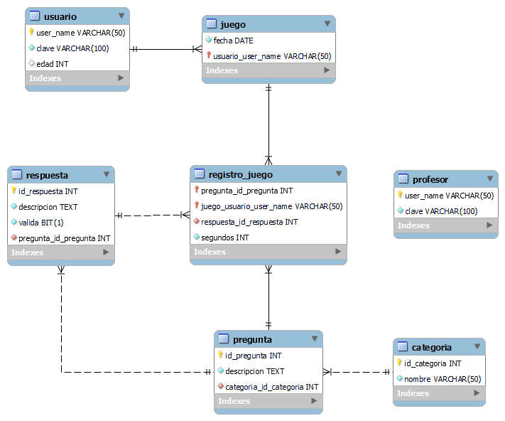
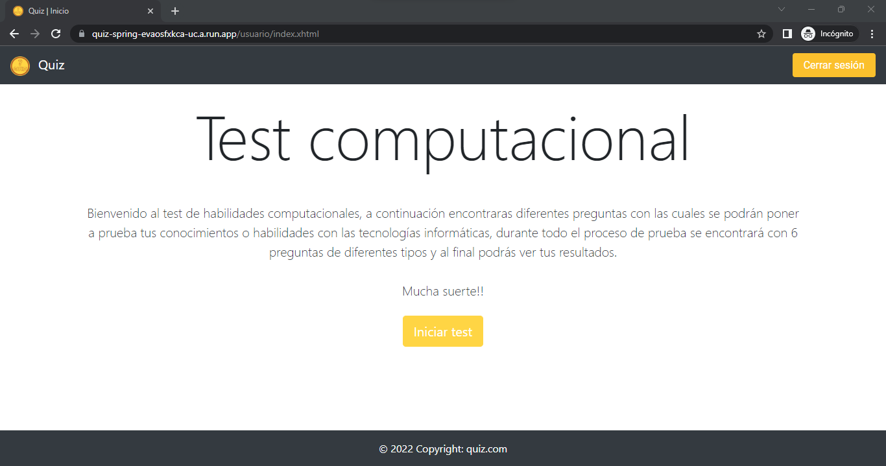
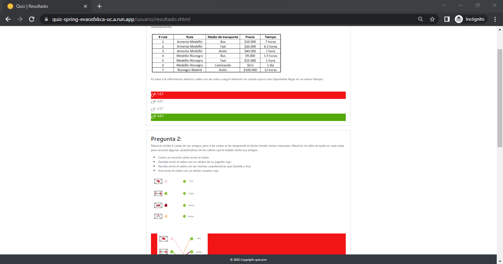

# Apartados técnicos

La aplicación fue desarrollada con el lenguaje de programación Java version 11, se utilizó el framework Spring boot, para construir el proyecto maven, para el apartado de persistencia utilizamos JPA y JPQL con una base de datos MYSQL, para la vista utilizamos JSF con la librería PRIMEFACES, para el tema de control de versiones utilizamos git y por último desplegamos el proyecto en Google Cloud utilizando Docker para contenerizar la aplicación.

##Modelo relacional

# Funcionalidades

La aplicación quiz cuenta con dos apartados o usuarios, el profesor, quien es el que crea las preguntas del test y el estudiante el cual responde el test.

##Profesor

El profesor podrá iniciar sesión por medio del siguiente link: [LoginProfesor]

El usuario por defecto es admin con clave admin.

Al iniciar sesión el profesor podrá crear, eliminar y editar las categorías que componen las preguntas:

Si entra a una determinada categoría el profesor podrá administrar las preguntas de esta (crear, editar, eliminar):

Y lo mismo será si entra a una determinada pregunta:

##Estudiante

El estudiante podrá iniciar sesión por medio del siguiente link: [LoginEstudiante]

Si no está registrado podrá hacer su registro, las personas que se van a registrar deben de tener entre 8 y 11 años, ya que esta es la edad a la cual va dirigido el test.

Cuando iniciamos sesión la aplicación nos da una breve introducción, el test consta de 6 preguntas de diferentes categorías elegidas al azar, cada que respondemos una pregunta nos dirá si la respondimos correctamente o no y al final tendremos una retroalimentación de todo el test en general.

Se puede observar que cada que respondemos una pregunta la aplicación nos dice si está correcta o no:

Y al finalizar la aplicación nos da los resultados del test:

El test solo se podrá hacer una vez por usuario.

[LoginProfesor]: <https://quiz-spring-evaosfxkca-uc.a.run.app/profesor/login.xhtml>
[LoginEstudiante]: <https://quiz-spring-evaosfxkca-uc.a.run.app>